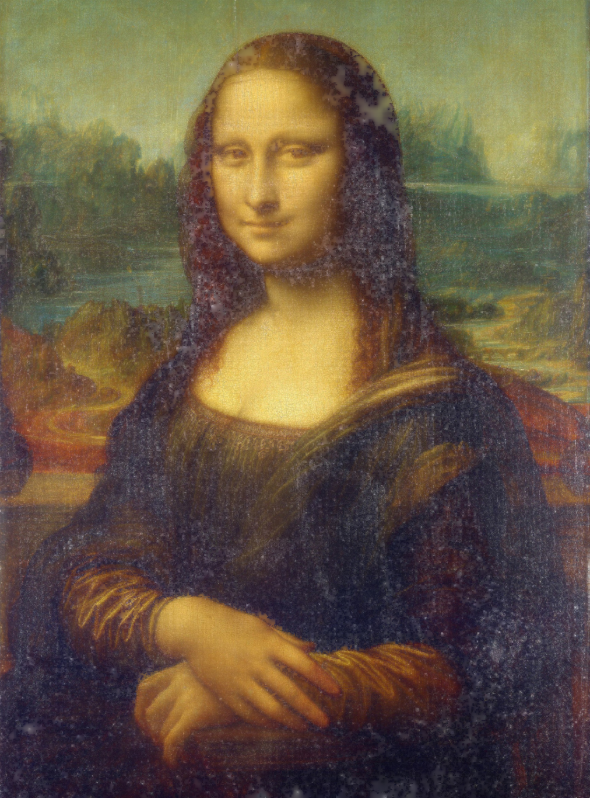
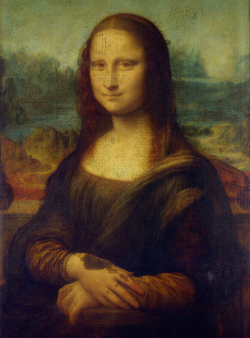
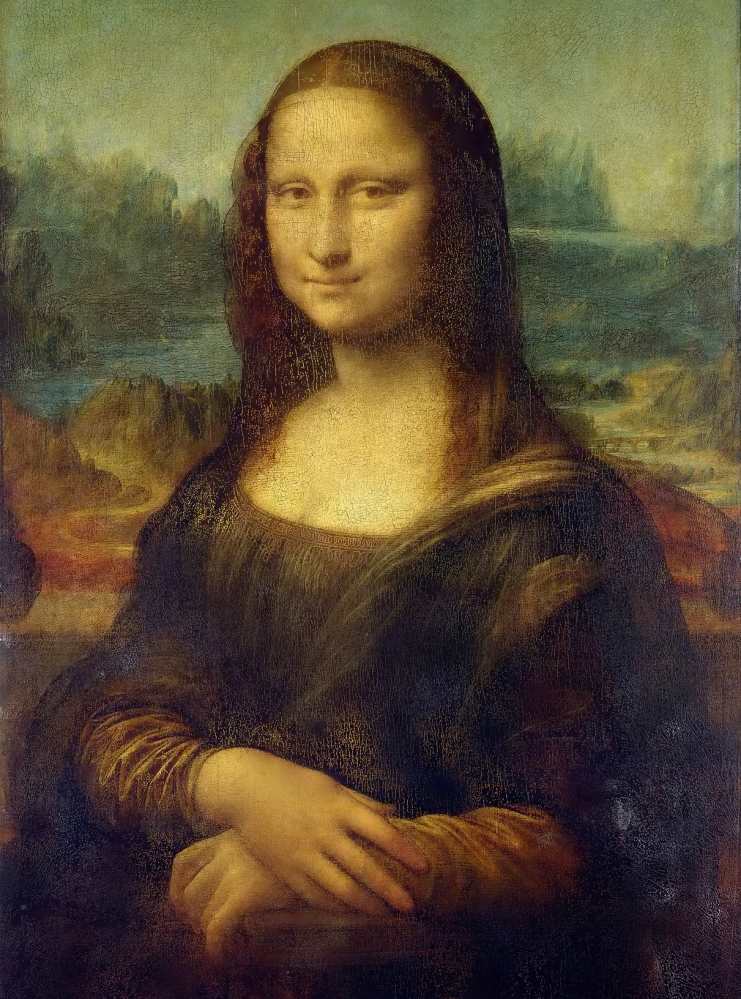
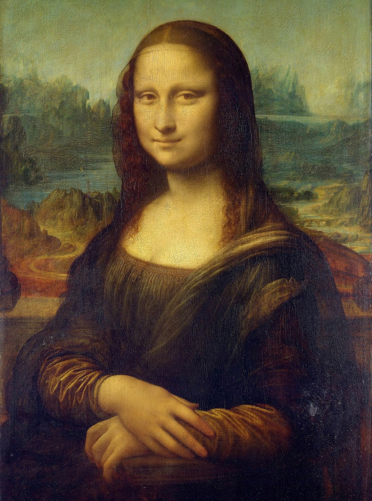

# [stb-image-djvul](https://github.com/ImageProcessing-ElectronicPublications/stb-image-djvul) demo.

DjVu Layered - image bundle on the mask + foreground + background using "Multi-scale binarization".

Degradation of images on layers mask, foreground and background by cluster analysis with a gradual decrease in block size.

## demo

### origin


### DjVuL

Separate image to Mask+Bg+Fg:

```shell
stbdjvul mona.jpg mona.mask.png mona.bg.png mona.fg.png 
Load: mona.jpg
image: 3036x4096:3
BG: 1012x1366:3
FG: 506x683:3
DjVuL... 11 level
Save png: mona.mask.png, mona.bg.png, mona.fg.png.
```

Mask:  
[Mask](images/mona.mask.png)  
Bg:  
  
Fg:  


#### NetPbm

Convert separate image to PNM:

```shell
pngtopnm mona.bg.png > mona.bg.ppm
pngtopnm mona.fg.png > mona.fg.ppm
pngtopnm mona.mask.png | ppmtopgm | pgmtopbm > mona.mask.pbm
```

#### DJVULibre

Coding to DjVu:

```shell
cjb2 mona.mask.pbm mona.mask.djvu
c44 mona.bg.ppm mona.bg.djvu
c44 -slice 100 mona.fg.ppm mona.fg.djvu
```

Extract and combine chunks:

```shell
djvuextract mona.mask.djvu Sjbz=mona.Sjbz.cnk
  Sjbz=mona.Sjbz.cnk --> "mona.Sjbz.cnk" (741921 bytes)
djvuextract mona.fg.djvu BG44=mona.FG44.cnk
  BG44=mona.FG44.cnk --> "mona.FG44.cnk" (18065 bytes)
djvuextract mona.bg.djvu BG44=mona.BG44.cnk
  BG44=mona.BG44.cnk --> "mona.BG44.cnk" (101299 bytes)
djvumake mona.djvul.djvu INFO=,,300 Sjbz=mona.Sjbz.cnk FG44=mona.FG44.cnk BG44=mona.BG44.cnk
```


### Compare:

#### Djvumake:

Man djvumake:

```man
          cjb2 mymask.pbm mymask.djvu
          djvumake my.djvu Sjbz=mymask.djvu PPM=myimage.ppm
```

Use `mona.mask.djvu`:

```shell
jpegtopnm mona.jpg > mona.ppm
djvumake mona.djvumake.djvu Sjbz=mona.mask.djvu PPM=mona.ppm
```



No Mask, only Bg:

```shell
c44 -dpi 300 mona.ppm mona.c44.djvu
```



### Result

```shell
ls -l *.djvu
  101321 mona.bg.djvu
 1339946 mona.c44.djvu
  861305 mona.djvul.djvu
  803208 mona.djvumake.djvu
   18087 mona.fg.djvu
  741963 mona.mask.djvu
```
