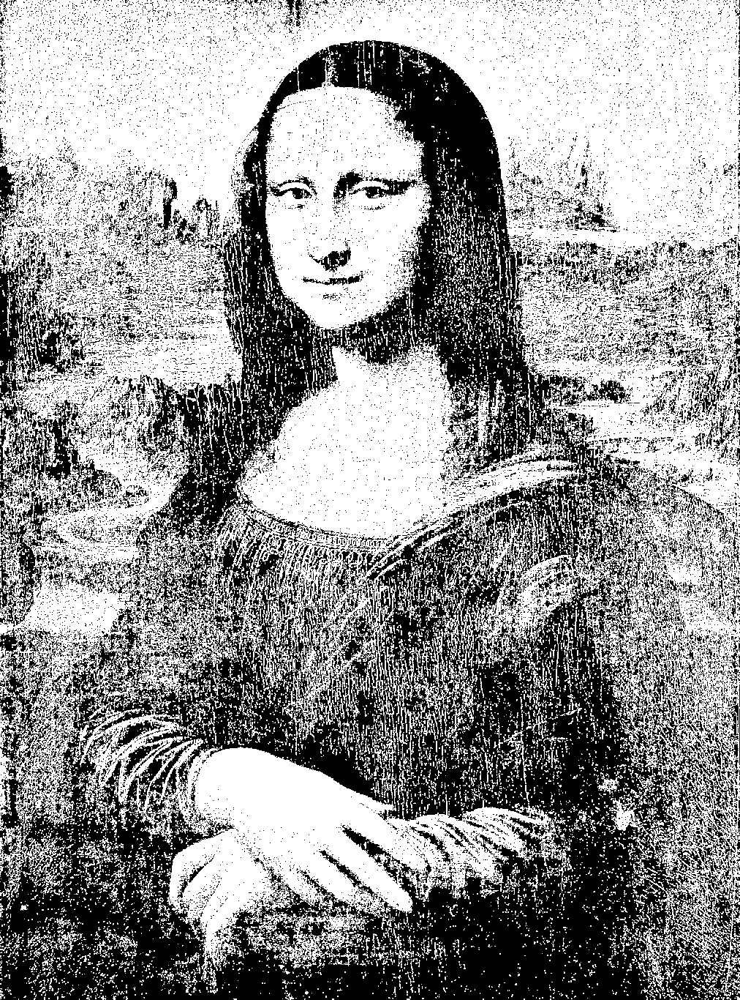

# [stb-image-djvul](https://github.com/ImageProcessing-ElectronicPublications/stb-image-djvul) demo.

DjVu Layered - image bundle on the mask + foreground + background using "Multi-scale binarization".

Degradation of images on layers mask, foreground and background by cluster analysis with a gradual decrease in block size.

## demo

### origin


---

### [DjVuL](https://sourceforge.net/p/imthreshold/wiki/DjVuL/?version=3)

Separate image to Mask+Bg+Fg:

```shell
stbdjvul mona.jpg mona.mask.png mona.bg.png mona.fg.png 
Load: mona.jpg
image: 3036x4096:3
BG: 1012x1366:3
FG: 506x683:3
DjVuL... 11 level
Save png: mona.mask.png, mona.bg.png, mona.fg.png.
```

Mask:  
[Mask](images/mona.mask.png)  
Bg:  
  
Fg:  


#### [Netpbm](https://netpbm.sourceforge.net/)

Convert separate image to PNM:

```shell
pngtopnm mona.bg.png > mona.bg.ppm
pngtopnm mona.fg.png > mona.fg.ppm
pngtopnm mona.mask.png | ppmtopgm | pgmtopbm > mona.mask.pbm
```

#### [DjVuLibre](https://djvu.sourceforge.net/)

Coding to DjVu:

```shell
cjb2 mona.mask.pbm mona.mask.djvu
c44 mona.bg.ppm mona.bg.djvu
c44 -slice 100 mona.fg.ppm mona.fg.djvu
```

Extract and combine chunks:

```shell
djvuextract mona.mask.djvu Sjbz=mona.Sjbz.cnk
  Sjbz=mona.Sjbz.cnk --> "mona.Sjbz.cnk" (741921 bytes)
djvuextract mona.fg.djvu BG44=mona.FG44.cnk
  BG44=mona.FG44.cnk --> "mona.FG44.cnk" (18065 bytes)
djvuextract mona.bg.djvu BG44=mona.BG44.cnk
  BG44=mona.BG44.cnk --> "mona.BG44.cnk" (101299 bytes)
djvumake mona.djvul.djvu INFO=,,300 Sjbz=mona.Sjbz.cnk FG44=mona.FG44.cnk BG44=mona.BG44.cnk
```


---

### [DjVuL](https://sourceforge.net/p/imthreshold/wiki/DjVuL/?version=3) using Bg and Fg mask

Separate image to Mask+Bg+Fg:

```shell
stbdjvul mona.jpg mona.mask.png mona.bg.png mona.fg.png mona.bgmask.png mona.fgmask.png 
Load: mona.jpg
image: 3036x4096:3
BG: 1012x1366:3
FG: 506x683:3
DjVuL... 11 level
Save png: mona.mask.png, mona.bg.png, mona.fg.png, mona.bgmask.png, mona.fgmask.png, mona.fgmask.png.
```

Mask:  
[Mask](images/mona.mask.png)  
Bg:  
  
Bgmask:  
  
Fg:  
  
Fgmask:  


#### [Netpbm](https://netpbm.sourceforge.net/)

Convert separate image to PNM:

```shell
pngtopnm mona.bg.png > mona.bg.ppm
pngtopnm mona.fg.png > mona.fg.ppm
pngtopnm mona.mask.png | ppmtopgm | pgmtopbm > mona.mask.pbm
pngtopnm mona.bgmask.png | ppmtopgm | pgmtopbm > mona.bgmask.pbm
pngtopnm mona.fgmask.png | ppmtopgm | pgmtopbm > mona.fgmask.pbm
```

#### [DjVuLibre](https://djvu.sourceforge.net/)

Coding to DjVu:

```shell
cjb2 mona.mask.pbm mona.mask.djvu
c44 -mask mona.bgmask.pbm mona.bg.ppm mona.bgm.djvu
c44 -slice 100 -mask mona.fgmask.pbm mona.fg.ppm mona.fgm.djvu
```

Extract and combine chunks:

```shell
djvuextract mona.mask.djvu Sjbz=mona.Sjbz.cnk
  Sjbz=mona.Sjbz.cnk --> "mona.Sjbz.cnk" (741921 bytes)
djvuextract mona.fgm.djvu BG44=mona.FG44.m.cnk
  BG44=mona.FG44.m.cnk --> "mona.FG44.m.cnk" (17732 bytes)
djvuextract mona.bgm.djvu BG44=mona.BG44.m.cnk
  BG44=mona.BG44.m.cnk --> "mona.BG44.m.cnk" (95094 bytes)
djvumake mona.djvul.m.djvu INFO=,,300 Sjbz=mona.Sjbz.cnk FG44=mona.FG44.m.cnk BG44=mona.BG44.m.cnk
```


---

### [DjVuL](https://sourceforge.net/p/imthreshold/wiki/DjVuL/?version=3) and lossy mask.

#### [DjVuLibre](https://djvu.sourceforge.net/)

Coding to DjVu:

```shell
cjb2 -losslevel 100 mona.mask.pbm mona.mask.l100.djvu
c44 -mask mona.bgmask.pbm mona.bg.ppm mona.bgm.djvu
c44 -slice 100 -mask mona.fgmask.pbm mona.fg.ppm mona.fgm.djvu
```

Extract and combine chunks:

```shell
djvuextract mona.mask.l100.djvu Sjbz=mona.Sjbz.l100.cnk
  Sjbz=mona.Sjbz.l100.cnk --> "mona.Sjbz.l100.cnk" (723372 bytes)
djvuextract mona.fgm.djvu BG44=mona.FG44.m.cnk
  BG44=mona.FG44.m.cnk --> "mona.FG44.m.cnk" (17732 bytes)
djvuextract mona.bgm.djvu BG44=mona.BG44.m.cnk
  BG44=mona.BG44.m.cnk --> "mona.BG44.m.cnk" (95094 bytes)
djvumake mona.djvul.l100.m.djvu INFO=,,300 Sjbz=mona.Sjbz.l100.cnk FG44=mona.FG44.m.cnk BG44=mona.BG44.m.cnk
```


---

### [DjVuL](https://sourceforge.net/p/imthreshold/wiki/DjVuL/?version=3) using `anisotropic`

Separate image to Mask+Bg+Fg:

```shell
stbdjvul -a -0.5 mona.jpg mona.mask.an.png mona.bg.an.png mona.fg.an.png mona.bgmask.an.png mona.fgmask.an.png 
Load: mona.jpg
image: 3036x4096:3
BG: 1012x1366:3
FG: 506x683:3
DjVuL... 11 level
Save png: mona.mask.an.png, mona.bg.an.png, mona.fg.an.png, mona.bgmask.an.png, mona.fgmask.an.png, mona.fgmask.an.png.
```

Mask:  
[Mask](images/mona.mask.an.png)  
Bg:  
  
Bgmask:  
  
Fg:  
  
Fgmask:  


#### [Netpbm](https://netpbm.sourceforge.net/)

Convert separate image to PNM:

```shell
pngtopnm mona.bg.an.png > mona.bg.an.ppm
pngtopnm mona.fg.an.png > mona.fg.an.ppm
pngtopnm mona.mask.an.png | ppmtopgm | pgmtopbm > mona.mask.an.pbm
pngtopnm mona.bgmask.an.png | ppmtopgm | pgmtopbm > mona.bgmask.an.pbm
pngtopnm mona.fgmask.an.png | ppmtopgm | pgmtopbm > mona.fgmask.an.pbm
```

#### [DjVuLibre](https://djvu.sourceforge.net/)

Coding to DjVu:

```shell
cjb2 -losslevel 100 mona.mask.an.pbm mona.mask.an.djvu
c44 -mask mona.bgmask.an.pbm mona.bg.an.ppm mona.bgm.an.djvu
c44 -slice 100 -mask mona.fgmask.an.pbm mona.fg.an.ppm mona.fgm.an.djvu
```

Extract and combine chunks:

```shell
djvuextract mona.mask.an.djvu Sjbz=mona.Sjbz.an.cnk
  Sjbz=mona.Sjbz.an.cnk --> "mona.Sjbz.an.cnk" (518435 bytes)
djvuextract mona.fgm.an.djvu BG44=mona.FG44.an.cnk
  BG44=mona.FG44.an.cnk --> "mona.FG44.an.cnk" (17626 bytes)
djvuextract mona.bgm.an.djvu BG44=mona.BG44.an.cnk
  BG44=mona.BG44.an.cnk --> "mona.BG44.an.cnk" (75368 bytes)
djvumake mona.djvul.an.djvu INFO=,,300 Sjbz=mona.Sjbz.an.cnk FG44=mona.FG44.an.cnk BG44=mona.BG44.an.cnk
```


---

## Compare

#### Djvumake:

Man djvumake:

```man
          cjb2 mymask.pbm mymask.djvu
          djvumake my.djvu Sjbz=mymask.djvu PPM=myimage.ppm
```

Use `mona.mask.djvu`:

```shell
jpegtopnm mona.jpg > mona.ppm
djvumake mona.djvumake.djvu Sjbz=mona.mask.djvu PPM=mona.ppm
```


No Mask, only Bg:

```shell
c44 -dpi 300 mona.ppm mona.c44.djvu
```


---

### Result

```shell
ls -l *.djvu
  101321 mona.bg.djvu
   75390 mona.bgm.an.djvu
   95116 mona.bgm.djvu
 1339946 mona.c44.djvu
  861305 mona.djvul.djvu
  611448 mona.djvul.an.djvu
  836216 mona.djvul.l100.m.djvu
  854766 mona.djvul.m.djvu
  803208 mona.djvumake.djvu
   18087 mona.fg.djvu
   17648 mona.fgm.an.djvu
   17754 mona.fgm.djvu
  741963 mona.mask.djvu
  518477 mona.mask.an.djvu
  723414 mona.mask.l100.djvu
```

---
